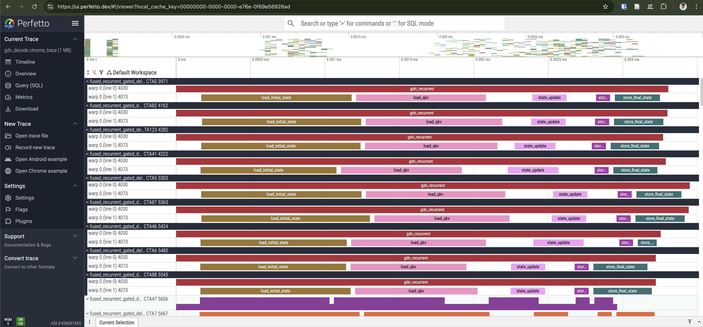

# Worklog Week 1

## Worklog 2026-02-21

- **FlashInfer baseline** (`fi-baseline`): Integrated FlashInfer's CuTe-DSL decode kernel (`gated_delta_rule_decode_pretranspose`) as a new algo. Achieves ~35x on RTX 3090, **~46.5x on B200** (best result so far).
- **Large gap between NCU and benchmark times**: NCU shows similar kernel durations (~3.8 µs Triton vs ~4.5 µs CuTe-DSL), but benchmark measures ~30-51 µs. The ~25-35 µs gap could be non-kernel overhead (launch latency, driver, L2 flush, event timing, etc.; root cause not yet isolated). FI's gap is ~9 µs smaller.

## Worklog 2026-02-20

Autotuning, micro-optimizations, and a TMA kernel variant.

- **Autotuning on B200**: Ran full config sweep (BV x num_warps x num_stages)
- **Proton line-level profiling**: Added PC-sampling mode to `make proton-fla` to find out which ops take most time.
- **Tile transpose**: Changed tile iteration order to match the k-last tensor layout.
- **Remove zero pre-init**: Stopped initializing state accumulator with zeros (unnecessary since we overwrite).
- **TMA kernel** (`fla-tma`): New kernel variant using TMA descriptors and warp-specialized producer/consumer loop. ~36x on RTX 3090 (best local result), but no improvement on B200.
- Claude thinks kernel is latency-bound, because in the RTX3090 it should take ~1 μs, but it takes ~50 μs.
- Added NCU profiling. The FLA kernel runtime is measured as ~4μs, even though FI-bench says 50μs. Strange.
- worked time: 4h06

## Worklog 2026-02-19

Proton intra-kernel profiling and kernel cleanup.

- Set up Proton profiling for the FLA Triton kernel (`scripts/profile_proton.py`).
- Stripped dead code from the inlined FLA kernel for our decode-only use case.
- Warp-level timeline trace (Perfetto) shows the per-CTA breakdown:
  
- Refactoring the FLA kernel yielded massive speedups. In particular moving the decay computation inside the kernel, and remove the state transposition + contiguous() calls.
- worked time: 5h25

## Worklog 2026-02-18

Project setup and first baselines for the GDN decode kernel.

- Set up project structure, documented GDN math and kernel interface in `CLAUDE.md`.
- **torch.compile'd PyTorch reference:** ~0.73 ms, ~1.8x speedup (RTX 3090).
- **FLA fused recurrent Triton kernel:** ~0.14 ms, ~9.5x speedup (RTX 3090).
  Called the Triton kernel directly (not the FLA wrapper) so torch.compile can
  fuse gate computation and state transposes.
- Added multi-algo dispatch (`--algo` flag / `ALGO` env var) across all scripts.
- Modal pipeline: hit `COMPILE_ERROR` on B200 because `flash-linear-attention`
  wasn't in the Modal image (not a dep of `flashinfer-bench`). Fixed.
- FLA fused recurrent achieves between 11.37 and 13.22x speedups on modal.
- I wanted compare the performance on the leaderboard, but the submission infrastructure is not yet operational.
- worked time: 4h13
